# Overview: Same application. Same CI/CD pipeline shape. Different runtime environments.

* the application remains unchanged
* GitHub Actions remains unchanged
* Docker images remain unchanged
* only the runtime/orchestration layer changes

From:

* Docker Compose on EC2

To:

* Kubernetes (kind)

# SkillPulse - Same App, Different Runtime

## Hackathon Objective

This project demonstrates how the **same application** can be shipped through the **same CI/CD pipeline** into two different runtime environments:

1. Docker Compose on Amazon EC2
2. Kubernetes (kind)

The application code never changes.

Only the runtime changes.

---

# Architecture

```text
GitHub Push
    ↓
GitHub Actions CI
    ↓
Docker Image Build
    ↓
Docker Hub Push
    ↓
GitHub Actions CD
    ↓
EC2 Deployment

Runtime 1:
Docker Compose

Runtime 2:
Kubernetes (kind)
```

---

# Tech Stack

| Layer     | Technology          |
| --------- | ------------------- |
| Frontend  | Nginx + HTML/CSS/JS |
| Backend   | Golang + Gin        |
| Database  | MySQL               |
| CI/CD     | GitHub Actions      |
| Registry  | Docker Hub          |
| Runtime 1 | Docker Compose      |
| Runtime 2 | Kubernetes (kind)   |
| Cloud     | Amazon EC2          |

---

# CI/CD Flow

Every push to `main` triggers:

* Docker image build
* Docker image push to Docker Hub
* Automatic EC2 deployment
* Container restart using Docker Compose

The same Docker images are later reused in Kubernetes.

---

# 🐳 Runtime 1 - Docker Compose Deployment

SkillPulse successfully deployed on EC2 using Docker Compose.

## Validation

```bash 
docker ps
```

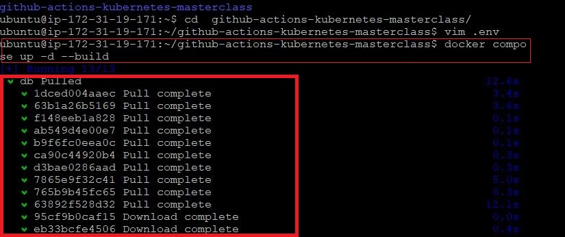

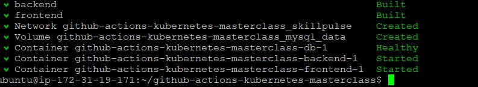

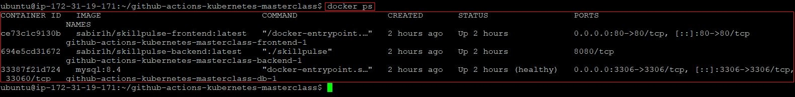

---

# ☸️ Runtime 2 - Kubernetes Deployment

The same SkillPulse application was deployed into a Kubernetes cluster using kind.

## Kubernetes Components

* Namespace
* Deployment
* Service
* StatefulSet
* PVC
* ConfigMap
* Secret

## Validation

```bash
kubectl get pods -n skillpulse

kubectl get svc -n skillpulse
```

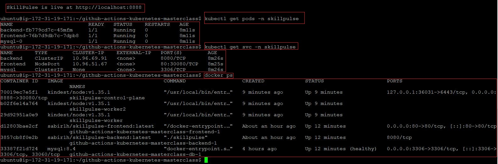

---

# 🔁 GitHub Actions CI/CD

GitHub Actions automatically:

* builds Docker images
* pushes images to Docker Hub
* deploys latest version to EC2

## Validation

GitHub Actions:

* CI ✅
* CD ✅

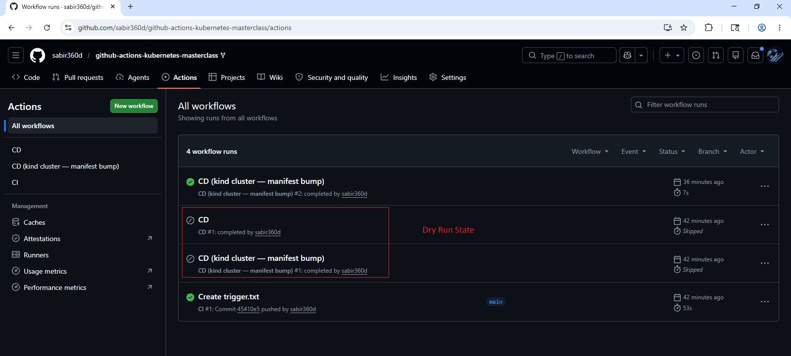

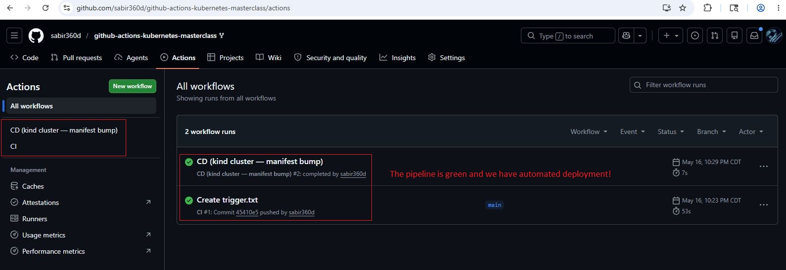

---

# 📦 Docker Hub Deployment

Docker images successfully pushed to Docker Hub.

Images:

* skillpulse-backend
* skillpulse-frontend


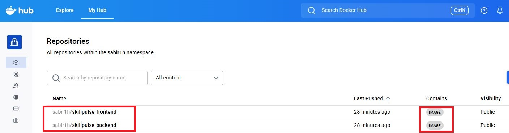


---

# 🌐 Live Application Validation

## Docker Compose Runtime

```text
http://EC2_PUBLIC_IP
```

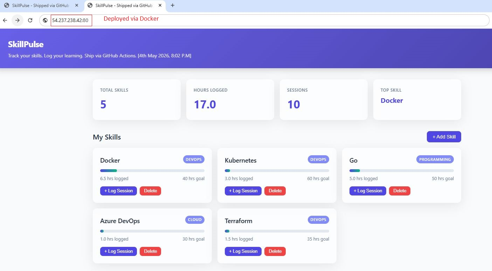

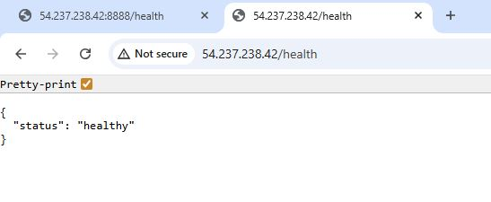

---

## Kubernetes Runtime

```text
http://EC2_PUBLIC_IP:8888
```

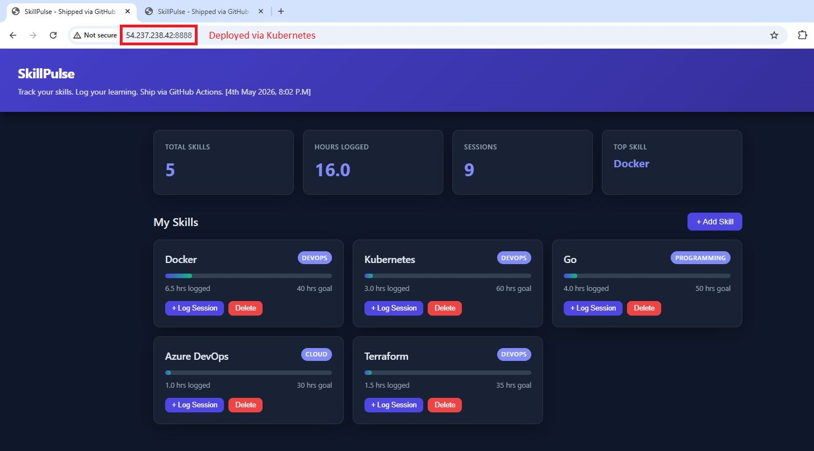

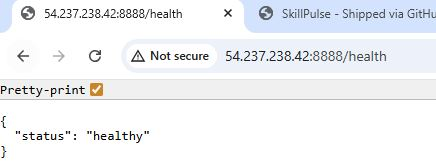

---

# Outcome

This project successfully demonstrates:

* One application
* One CI/CD pipeline
* One image build process
* Multiple deployment runtimes

The deployment strategy evolved from:

```text
Docker Compose → Kubernetes
```

without changing the application itself.

This reflects how modern DevOps workflows scale applications from simple container deployments to orchestrated Kubernetes environments demonstrating a practical end-to-end DevOps workflow used in modern production environments.

---

# Challenges Faced
Resource Constraints

Initial deployment on t3.micro EC2 instance caused Kubernetes and Docker builds to stall because of memory limitations.

# Solution

Migrated to: c7i-flex.large

This resolved:

Docker build delays
Kubernetes startup issues
MySQL memory pressure

---


